# DeepEncoder Structure Analysis (DeepSeek-OCR)

This document describes the **vision encoding pipeline** used in DeepSeek-OCR, as implemented in the HuggingFace model [`deepseek-ai/DeepSeek-OCR`](https://huggingface.co/deepseek-ai/DeepSeek-OCR). The pipeline is defined in the cached module `deepencoder.py` and wired in `modeling_deepseekocr.py`.

---

## High-Level Summary

**"DeepEncoder" is not a single network.** It is a **dual vision tower plus projector**:

1. **SAM ViT-B** (`ImageEncoderViT`) – dense, high-resolution features.
2. **CLIP-L** (`VitModel`) – consumes SAM’s patch-level features and refines them.
3. **Concat** – CLIP tokens (no CLS) + flattened SAM features → 2048-d per spatial position.
4. **MlpProjector** – single linear layer 2048 → 1280 (vision embedding dim for the LLM).

Optional layout tokens: `image_newline`, `view_seperator` (both 1280-d).

---

## Data Flow Diagram

```mermaid
flowchart LR
  subgraph input [Input]
    patches[Patches B x 3 x H x W]
    image_ori[Full image B x 3 x H0 x W0]
  end

  subgraph sam [SAM ViT-B]
    sam_pe[PatchEmbed 16x16]
    sam_blocks[12 Blocks]
    sam_neck[Neck 768 to 256]
    sam_net2[net_2 256 to 512 stride 2]
    sam_net3[net_3 512 to 1024 stride 2]
  end

  subgraph clip [CLIP-L]
    clip_emb[Embeddings with SAM as patch_embeds]
    clip_ln[Pre LayerNorm]
    clip_tx[NoTPTransformer 24 layers]
  end

  subgraph fusion [Fusion and Projection]
    concat[Concat CLIP no-CLS and SAM flatten]
    proj[Linear 2048 to 1280]
  end

  patches --> sam_pe
  sam_pe --> sam_blocks
  sam_blocks --> sam_neck
  sam_neck --> sam_net2
  sam_net2 --> sam_net3
  sam_net3 --> sam_out[SAM features B x 1024 x 16 x 16]

  patches --> clip_emb
  sam_out --> flatten[Flatten to B x 256 x 1024]
  flatten --> clip_emb
  clip_emb --> clip_ln
  clip_ln --> clip_tx
  clip_tx --> clip_out[CLIP output B x 257 x 1024]

  clip_out --> slice[Slice 1: -> B x 256 x 1024]
  sam_out --> flatten2[Flatten permute B x 256 x 1024]
  slice --> concat
  flatten2 --> concat
  concat --> proj
  proj --> out[Vision tokens B x 256 x 1280]
```

---

## 1. SAM ViT-B (`build_sam_vit_b` → `ImageEncoderViT`)

**File:** `deepencoder.py` (lines 439–489, 647–664).

- **Role:** Dense, high-resolution vision backbone (SAM-style ViT).
- **Input:** `x`: `(B, 3, 1024, 1024)` (or cropped patches with same patch grid).
- **Output:** `(B, 1024, 16, 16)` (spatial feature map).

### Components

| Component        | Details |
|-----------------|--------|
| **PatchEmbed**  | `nn.Conv2d(3, 768, kernel_size=16, stride=16)`. Output `(B, 768, 64, 64)` then permuted to `(B, 64, 64, 768)`. |
| **Position**    | `pos_embed`: `(1, 64, 64, 768)`; interpolated to target size via `get_abs_pos_sam`. |
| **Blocks**      | 12 × `Block` (Attention + MLPBlock). Optional window attention (window_size=14), global attention at indices [2,5,8,11]. Relative pos in Attention. |
| **Neck**        | Conv 768→256, LayerNorm2d, Conv 3×3, LayerNorm2d. |
| **net_2**       | `nn.Conv2d(256, 512, kernel_size=3, stride=2, padding=1)`. |
| **net_3**       | `nn.Conv2d(512, 1024, kernel_size=3, stride=2, padding=1)`. |

### Block / Attention

- **Block:** Pre-norm, Attention (with optional rel_pos), residual, MLP (LayerNorm + `MLPBlock`: Linear → GELU → Linear), residual.
- **Attention:** `qkv` linear, optional decomposed relative pos (`rel_pos_h`, `rel_pos_w`), then `scaled_dot_product_attention`, then `proj`.

### Output shape

- After blocks: `(B, 64, 64, 768)`.
- After neck: `(B, 256, 64, 64)`.
- After net_2: `(B, 512, 32, 32)`.
- After net_3: **`(B, 1024, 16, 16)`** → flattened to **`(B, 256, 1024)`** when concatenated with CLIP.

---

## 2. CLIP-L (`build_clip_l` → `VitModel`)

**File:** `deepencoder.py` (lines 241–291, 362–375, 399–414, 449–514, 516–534).

- **Role:** Refine patch-level features; in OCR it is fed **SAM’s output as patch embeddings** (no separate patch embedding for CLIP on raw pixels in this path).
- **Input:** `x` = pixel_values (e.g. patches), `patch_embeds` = optional; when provided (from SAM), CLIP uses them instead of its own `patch_embedding(x)`.
- **Output:** `(B, 257, 1024)` (1 CLS + 256 patch tokens).

### Config (`vit_model_cfg`)

- `num_layers=24`, `hidden_size=1024`, `num_attention_heads=16`, `ffn_hidden_size=4096`.
- `image_size=224`, `patch_size=14` → 256 patches + 1 CLS = 257 positions.
- `layernorm_epsilon=1e-5`, `pre_layernorm_epsilon=1e-5`.

### Components

| Component              | Details |
|------------------------|--------|
| **CLIPVisionEmbeddings** | `class_embedding` (1024), `patch_embedding` Conv2d(3, 1024, 14, 14), `position_embedding` (257, 1024). If `patch_embeds` is given: use it; else `patch_embedding(pixel_values)`. Then flatten, concat CLS, add positional embedding (with `get_abs_pos` interpolation). |
| **Pre LayerNorm**      | LayerNorm(1024, eps=1e-5). |
| **NoTPTransformer**    | 24 × **NoTPTransformerBlock**. |
| **NoTPTransformerBlock** | Pre-norm → **NoTPAttention** (qkv_proj, 3-way split, SDPA, out_proj) → residual → Pre-norm → **NoTPFeedForward** (fc1 → quick_gelu → fc2) → residual. |
| **NoTPFeedForward**    | `fc1`: Linear(1024, 4096), `fc2`: Linear(4096, 1024); activation `quick_gelu` (x * sigmoid(1.702*x)). |

In OCR, `vision_model(patches, local_features_1)` passes SAM’s `(B, 256, 1024)` as `patch_embeds`, so CLIP runs its 24 layers on (CLS + SAM-derived patch tokens).

---

## 3. Fusion and Projector (in `DeepseekOCRModel.forward`)

**File:** `modeling_deepseekocr.py` (lines 356–365, 396–430).

- **Concat (per image/crop):**
  - `local_features_2 = vision_model(patches, local_features_1)` → `(B, 257, 1024)`.
  - Drop CLS: `local_features_2[:, 1:]` → `(B, 256, 1024)`.
  - SAM: `local_features_1` is `(B, 1024, 16, 16)` → `flatten(2).permute(0, 2, 1)` → `(B, 256, 1024)`.
  - Concat on last dim: `(B, 256, 1024)` + `(B, 256, 1024)` → **`(B, 256, 2048)`**.
- **Projector:** `MlpProjector(Dict(projector_type="linear", input_dim=2048, n_embed=1280))` → single `nn.Linear(2048, 1280)`.
- **Output:** **`(B, 256, 1280)`** vision tokens (or variable length after layout with newline/view_separator).

### Layout tokens

- `image_newline`: `(1280,)` – inserted between image rows in the sequence.
- `view_seperator`: `(1280,)` – inserted between “views” (e.g. global vs patch views).

These are applied when building the final sequence that is scattered into `inputs_embeds` via `images_seq_mask`.

---

## 4. MlpProjector (for this model)

**File:** `deepencoder.py` (lines 19–169).

- In DeepSeek-OCR only the **linear** variant is used: `projector_type="linear"`, `input_dim=2048`, `n_embed=1280` → `nn.Linear(2048, 1280)`.
- Other variants (mlp_gelu, downsample, split, etc.) exist in the file but are not used by this config.

---

## 5. Input/Output Summary

| Stage        | Input shape (typical)     | Output shape        |
|-------------|---------------------------|----------------------|
| SAM ViT-B   | (B, 3, 1024, 1024) or crops | (B, 1024, 16, 16)  |
| SAM → CLIP  | (B, 256, 1024) as patch_embeds | —                 |
| CLIP-L      | (B, 257, 1024) internal   | (B, 257, 1024)       |
| Concat      | (B, 256, 1024) + (B, 256, 1024) | (B, 256, 2048)   |
| Projector   | (B, 256, 2048)            | (B, 256, 1280)      |

The resulting 1280-d tokens are then placed into the LLM’s `inputs_embeds` according to `images_seq_mask` and combined with text embeddings for the DeepSeekV2 decoder.

---

## 6. Weight and State Dict Hints

- **SAM:** `build_sam_vit_b(checkpoint=None)` – state dict can be loaded from checkpoint with key stripping (e.g. `vision_tower_high` prefix in one variant).
- **CLIP-L:** `VitModel` + `vit_model_cfg` – standard LayerNorm, Linear, Embedding names under the model’s `embeddings`, `pre_layrnorm`, `transformer.layers.*`.
- **Projector:** Single linear; in `DeepseekOCRModel` it’s `self.projector` (e.g. `model.projector.layers` or similar for the linear module).
- **Special params:** `image_newline`, `view_seperator` on the main OCR model.

For TTNN implementation, you will need to map these PyTorch modules to TTNN ops and convert weights (and optionally fuse SAM + CLIP + projector into one “DeepEncoder” interface for clarity).

---

## 7. References in Repo

- HuggingFace cache: `~/.cache/huggingface/modules/transformers_modules/deepseek-ai/DeepSeek-OCR/<commit>/deepencoder.py`, `modeling_deepseekocr.py`.
- OCR model class: `DeepseekOCRModel` / `DeepseekOCRForCausalLM` in `modeling_deepseekocr.py`; vision pipeline is in `DeepseekOCRModel.forward` (images branch).
